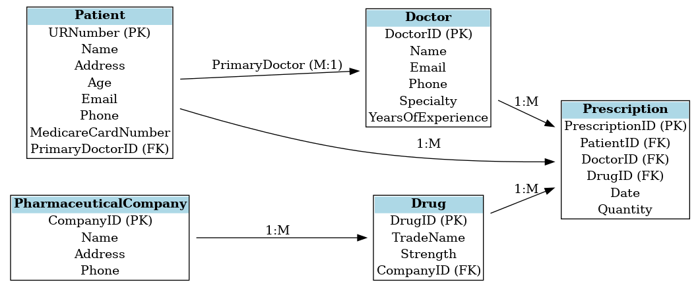

# Prescription System - Database Design & DML Exercises

## 📁 Overview

This project includes:

1. **Relational Database Model** for a prescription management system at Barwon Health, Geelong.
2. **SQL DML Exercises** to practice common queries and database operations.

---

## 🏥 Part 1: Prescription System Database Design

### 🎯 Objective
Design a database to manage the operations of prescribing drugs to patients by doctors, while maintaining records for drugs and pharmaceutical companies.

### 📦 Entities & Attributes

- **Patient**
  - URNumber (PK)
  - Name, Address, Age, Email, Phone
  - MedicareCardNumber (Optional)
  - PrimaryDoctorID (FK)

- **Doctor**
  - DoctorID (PK)
  - Name, Email, Phone, Specialty, YearsOfExperience

- **PharmaceuticalCompany**
  - CompanyID (PK)
  - Name, Address, Phone

- **Drug**
  - DrugID (PK)
  - TradeName, Strength
  - CompanyID (FK)

- **Prescription**
  - PrescriptionID (PK)
  - PatientID (FK), DoctorID (FK), DrugID (FK)
  - Date, Quantity

### 🔁 Relationships

- A patient has one primary doctor (1:M)
- A doctor can prescribe many drugs to many patients (M:N via `Prescription`)
- A drug is supplied by one company (1:M)
- On company deletion, associated drugs are also deleted (cascade)

### 📷 ER Diagram



---

## 🛠️ Part 2: SQL DML Exercises

### 📘 Categories

| Category               | SQL Topics Covered |
|------------------------|--------------------|
| Basic Queries          | SELECT, WHERE, ORDER BY, TOP, DISTINCT |
| Filtering              | AND, IN, BETWEEN, LIKE, NULL |
| Aliases & Joins        | AS, INNER JOIN     |
| Aggregates & Grouping  | COUNT, GROUP BY, HAVING, ROLLUP, CUBE |
| Advanced Subqueries    | EXISTS, CTE, GROUPING SETS |
| Set Operations         | UNION              |
| Data Manipulation      | INSERT, UPDATE, DELETE |
| Transactions & Views   | BEGIN, COMMIT, CREATE VIEW |
| Optimization & Backup  | CREATE INDEX, BACKUP DATABASE |

### 🧪 Sample Query

```sql
-- Retrieve doctors with >5 years experience in Cardiology
SELECT * FROM Doctor
WHERE YearsOfExperience > 5 AND Specialty = 'Cardiology';
```
